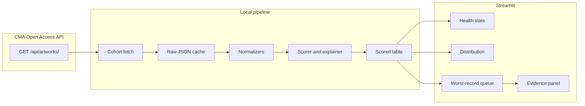

# Metadata Completeness Triage — Architecture

A Streamlit dashboard that samples 250–1,000 artwork records from the Cleveland Museum of Art Open Access API, turns inconsistent catalog text into a completeness score, and ranks the records a collections team should clean up first.

The product is a triage queue. The hard work is the scoring policy: deciding what counts as a date, how precise that date is, when a medium is specific enough, and when an attribution is clear. The application code exists to apply that policy the same way every time and to show the evidence.

APP_TITLE = "Dust & Data"

## Contents

1. [Purpose](#1-purpose)
2. [Users and jobs](#2-users-and-jobs)
3. [Scope](#3-scope)
4. [System overview](#4-system-overview)
5. [Source contract](#5-source-contract)
6. [Cohort](#6-cohort)
7. [Pipeline](#7-pipeline)
8. [Canonical record](#8-canonical-record)
9. [Scoring policy](#9-scoring-policy)
10. [Dashboard](#10-dashboard)
11. [Visual design](#11-visual-design)
12. [Module layout](#12-module-layout)
13. [Configuration as policy](#13-configuration-as-policy)
14. [Caching and refresh](#14-caching-and-refresh)
15. [Testing](#15-testing)
16. [Failure modes](#16-failure-modes)
17. [How a session runs](#17-how-a-session-runs)
18. [First implementation milestones](#18-first-implementation-milestones)
19. [Decisions worth keeping visible](#19-decisions-worth-keeping-visible)
20. [API shapes and parsing](#20-api-shapes-and-parsing)
21. [Runtime types and UI bundle](#21-runtime-types-and-ui-bundle)
22. [Stratified allocation (formal)](#22-stratified-allocation-formal)
23. [Cache keys and policy fingerprint](#23-cache-keys-and-policy-fingerprint)
24. [Streamlit state and filters](#24-streamlit-state-and-filters)
25. [Glossary](#25-glossary)
26. [Future extensions](#26-future-extensions)

## 1. Purpose

Catalogers and a collections platform team need a ranked list of records that are weak in public-facing metadata, with the exact gap named on each row. Aggregate charts tell them whether the problem is dates, images, media, names, or label text, and whether it clusters in one department.

A record is "complete" here only in the narrow sense that a visitor-facing catalog can say what the object is, who made it, when, in what medium, with a picture and a short description. Scholarly completeness (provenance, citations, inscriptions, catalogue raisonné) is out of scope for the score.

## 2. Users and jobs

| Who | Job the dashboard supports |
| --- | --- |
| Collections data manager | See overall health, the score distribution, and which departments are weakest. |
| Cataloger | Open the worst records, read the specific gap ("date is century-level", "attribution is circle-of"), and fix the source record. |
| Platform engineer | Confirm the score is stable, explainable, and driven by configuration a curator can review. |

Each row must answer three questions without a second tool: which record, what is wrong, and which raw value produced that judgment.

## 3. Scope

**In scope**

- Pull a cohort of 250, 500, or 1,000 artworks from the public API (no key), with 500 as the default.
- Normalize date, medium, attribution, description, and image presence.
- Score each record on those six judgments (image presence, date presence, date precision, medium specificity, attribution clarity, description presence).
- Show health stats, a score distribution, a department breakdown, and a worst-first table whose gap text is generated from the same rules as the score.
- Cache responses locally so the dashboard is usable offline after the first fetch and so re-scoring does not hit the API.
- Lock the policy in versioned vocabularies and table-driven tests.

**Out of scope**

- Writing corrections back to the museum.
- Computer vision, image-quality scoring, or downloading image binaries.
- Full-corpus scoring of all ~64,000 records in the first version. The pipeline is cohort-shaped so a later run can raise the cap.
- Provenance, citations, exhibitions, inscriptions, and measurements as score inputs.
- Authentication, multi-user accounts, or a database server.

## 4. System overview



Four boundaries keep the messy part inspectable:

1. **Fetch** talks to the network and writes raw JSON. It does not interpret catalog text.
2. **Normalize** maps raw fields onto small enums (`date_band`, `medium_band`, `attribution_band`, and so on). It does not know about weights.
3. **Score** applies weights and writes a 0–100 composite plus structured gaps. It does not parse strings.
4. **UI** reads the scored table only. It does not reimplement a rule.

Re-tuning "is a decade good enough?" changes configuration and the normalizer tests. It does not change the dashboard.

## 5. Source contract

Base URL: `https://openaccess-api.clevelandart.org/api/artworks/`

Documented behavior this design relies on (Open Access API 4.x):

- No API key. Metadata is published CC0. Images are present only when `share_license_status` is `CC0`; copyrighted works return metadata with images withheld.
- `limit` caps a response at 1,000. Omitting `limit` already returns that maximum, so a single unfiltered call is one cohort, not the collection.
- `skip` plus `limit` paginates. `info.total` is the match count for the current filters.
- `fields` accepts a comma-separated allow-list. Request only the fields below so payloads stay small and nested objects (`creators`, `images`) still arrive whole.
- `department` and `type` filter server-side. Valid departments and types are the lists in the API's Appendix B and Appendix C.
- The dataset refreshes from the collections system daily, typically by 05:00. A cache TTL of 24 hours matches that cadence.
- `has_image` exists and must stay **off**. Filtering to records that already have images deletes the gap the tool is built to find.

**Response envelope** (every list call):

```json
{
  "info": { "total": 64123, "limit": 1000, "skip": 0 },
  "data": [ { "...": "artwork object" } ]
}
```

Errors are HTTP status codes with a plain body. The client treats any non-2xx as failure for that request slice; it does not assume a JSON error schema.

Fields requested:

```
id, accession_number, title, url, department, collection, type,
record_type, share_license_status, updated_at,
creation_date, creation_date_earliest, creation_date_latest, date_text,
creators, culture, technique, support_materials,
description, images
```

Fields deliberately unused for scoring, and why:

| Field | Treatment |
| --- | --- |
| `tombstone` | Display string assembled by the museum from the same atoms. Parsing it would double-count and hide which atom is empty. |
| `sortable_date` | A single year for sorting. Treating it as precision would make "19th century" look like an exact year. |
| `date_text` | Computed companion to `creation_date`. Shown in the evidence panel when it differs. The score reads `creation_date` plus the earliest/latest span. |
| `did_you_know`, `early_education_description`, `artlens_description` | Interpretive extras. They do not satisfy "has a description." |
| `support_materials` | Often empty when `technique` already says "oil on canvas." Used only as a bump when technique is generic and the support list names a real material. |

`culture` is context for the evidence panel. It becomes an attribution signal only when `creators` is empty, where the record has a place or period and no maker.

## 6. Cohort

Default cohort size is 500 records, with 250 and 1,000 available for quick scans and deeper audits. The API's default order is not a random sample of the collection, and one department (Prints, for example) can dominate the first page. The default fetch is therefore a **proportional stratified sample by department**.

Procedure:

1. For each department in the configured list, `GET` with `department={name}&limit=1` and read `info.total`.
2. Allocate the selected number of slots proportional to those totals, with a minimum of 1 for any department that has records, then trim the largest departments until the allocation matches the selected sample size.
3. For each department, `GET` with `limit={slots}` and `fields={...}`. If a department's allocation exceeds 1,000, page with `skip`.
4. Concatenate, drop duplicate `id`s, and persist one cache file per cohort key.

The sidebar can replace stratification with a single department or type. The selected sample size still applies, and this mode is useful when a curator is already working inside one collection area.

`record_type` values are `object`, `cover`, `part`, and `component`. Parts are incomplete by the data model. The default queue includes `object` and `cover` only. A toggle adds parts and components so a curator can audit them separately. They stay in the cache either way.

The cohort banner states the sample size and mode in plain language. Health stats describe the cohort, not the whole museum, and the UI says so.

**Department universe for stratification** matches API Appendix B (exact strings, including punctuation):

| | | |
| --- | --- | --- |
| African Art | American Painting and Sculpture | Art of the Americas |
| Chinese Art | Contemporary Art | Decorative Art and Design |
| Drawings | Egyptian and Ancient Near Eastern Art | European Painting and Sculpture |
| Greek and Roman Art | Indian and South East Asian Art | Islamic Art |
| Japanese Art | Korean Art | Medieval Art |
| Modern European Painting and Sculpture | Oceania | Performing Arts, Music, & Film |
| Photography | Prints | Textiles |

`src/dust/config.py` holds this list as `DEPARTMENTS`. If the museum adds a department in a future API release, stratified fetch skips unknown names until config is updated; a one-off `limit=1` probe during refresh can log departments that returned `info.total > 0` but are not in config.

Sidebar **type** filter uses Appendix C values verbatim (`Painting`, `Print`, `Photograph`, …). The full type list is not loaded into the UI; the select box is populated from distinct `type` values in the current scored frame so curators only see types present in the cohort.

Formal allocation steps are in [section 22](#22-stratified-allocation-formal).

## 7. Pipeline

```
raw artwork JSON
  -> ArtworkRaw            (typed parse, unknown keys ignored)
  -> NormalizedRecord      (enums + cleaned strings + evidence)
  -> ScoredRecord          (band points, weighted total, gap list)
  -> pandas DataFrame      (one row per artwork, UI-ready)
```

Parsing rules:

- Missing, null, empty string, and whitespace-only are the same state: absent.
- Lists that arrive as null become `[]`.
- Integers that arrive as numeric strings are coerced. A failed coercion leaves the year absent and sets `parse_warnings`.
- One bad record does not fail the cohort. It scores whatever dimensions parsed and carries `parse_warnings` into the evidence panel.

The raw document is stored beside the scored row (accession number, the original date string, the original technique, the creator objects). The evidence panel renders raw and normalized values together so a cataloger can disagree with the rule.

## 8. Canonical record

After normalization, every artwork has this shape. Scores read only this object.

```text
id, accession_number, title, url
department, type, record_type
share_license_status
updated_at

image_state          present | withheld_by_license | absent
date_state           missing | present
date_band            missing | undated_text | multi_century | century
                     | generation | decade | circa | narrow_range | exact
date_span_years      int or null
date_display         original creation_date, possibly blank
date_conflict        bool

medium_band          missing | generic | material_only | specific
medium_canonical     normalized key, possibly blank
medium_raw           original technique

attribution_band     missing | unknown | culture_only | qualified
                     | attributed | named
attribution_label    short text for the queue, e.g. "circle of Song Xu"
qualifier_raw        original qualifier or blank

description_band     missing | stub | present
description_chars    int

parse_warnings       list of strings
```

## 9. Scoring policy

Each dimension produces a band and a band score in `[0, 1]`. The composite is a weighted sum on a 0–100 scale. Weights live in configuration (section 12), not in the normalizers.

Default weights, chosen so identity and time outrank label copy, and so a missing picture hurts without letting copyright dominate the queue:

| Dimension | Weight | Band score used |
| --- | --- | --- |
| Image | 15 | `image_state` mapped below |
| Date precision | 25 | `date_band` (absence is the zero band, so "has a date" is included) |
| Medium specificity | 20 | `medium_band` |
| Attribution clarity | 25 | `attribution_band` |
| Description | 15 | `description_band` |

`date_state` is stored so the health row can report "% with any date" separately from "% with a year-level date." It does not add a second date term to the composite.

Composite = round(100 × Σ weight_i × band_score_i / Σ weight_i). With the defaults, that is the weighted sum itself.

### 9.1 Image

An image counts as present when `images.web.url` is a non-empty URL. Print and full renditions are ignored for the score; the web rendition is the one a catalog page needs. Sketchfab and `alternate_images` do not satisfy the check.

| `image_state` | When | Band score |
| --- | --- | --- |
| `present` | web URL is non-empty | 1.0 |
| `withheld_by_license` | no web URL and `share_license_status` is `Copyrighted` | excluded from the composite (see below) |
| `absent` | no web URL and the license is `CC0` or `Other` | 0.0 |

Copyrighted records are metadata-complete on every other dimension and still have no public image, because the API withholds it. Counting that as a cataloging failure would pin the bottom of the queue to a legal status. For `withheld_by_license`, the image weight is removed from that record's denominator and the gap text says "No public image — withheld by license (`Copyrighted`)." The health stat "% missing a public image" still includes them, split into "withheld" and "absent on a CC0/Other record" so the team can see both.

The score does not HTTP-check the URL. A nightly optional check can flag broken links later; the first version treats a non-empty web URL as presence.

### 9.2 Dates

Inputs: `creation_date` (string), `creation_date_earliest` (year, negative for BCE), `creation_date_latest` (year). Span is `latest − earliest` when both years parse. BCE is a sign, not a missing value.

The span is the precision measurement. The string is the cataloger's wording. Both are required because they disagree often enough to matter: a string can say "19th century" while a year field was filled with a single placeholder, or a string can say "c. 1890" while the year span is a decade.

**String classes** (case-insensitive, punctuation-tolerant):

| Class | Patterns that define it | Examples |
| --- | --- | --- |
| `blank` | absent | |
| `undated` | `n.d.`, `nd`, `no date`, `unknown`, `undated` | `n.d.` |
| `hedged` | leading or embedded `c.`, `ca.`, `circa`, `about`, `approximately`, `approx.` | `c. 1890` |
| `decade_word` | a year ending in `0s` | `1890s`, `the 1890s` |
| `century_word` | `Nth century`, `NNNN00s`, `mid/early/late` + century | `19th century`, `1500s`, `late 19th century` |
| `exact_word` | a 1–4 digit year, optional BCE/CE, no hedge and no range | `1890`, `460 BCE` |
| `range_word` | two years joined by `-`, `/`, or `to` | `1890-1895`, `c. 1550-1650` |
| `other_text` | anything else with letters and no year | dynasty or period names that never received numeric years |

**Span classes** when both years exist:

| Class | Span in years |
| --- | --- |
| `exact_span` | 0–1 |
| `narrow_span` | 2–7 |
| `decade_span` | 8–19 |
| `generation_span` | 20–49 |
| `century_span` | 50–150 |
| `multi_span` | > 150 |

Band selection uses the **weaker** of the string class and the span class. A hedged year with a one-year span is `circa`, not `exact`. A century phrase with a one-year span is `century`, and `date_conflict` is true. A blank string with a usable span scores from the span alone and records the warning `display date missing`.

| `date_band` | Rule | Band score | Queue language |
| --- | --- | --- | --- |
| `missing` | string blank and years absent | 0.00 | Date missing |
| `undated_text` | undated token, or `other_text` with no years | 0.15 | Date unparsed: "{raw}" |
| `multi_century` | weaker signal is `multi_span` | 0.30 | Date spans {n} years: "{raw}" |
| `century` | weaker signal is century | 0.45 | Date is century-level: "{raw}" |
| `generation` | weaker signal is generation | 0.65 | Date is a generation-wide range: "{raw}" |
| `decade` | weaker signal is decade | 0.80 | Date is decade-level: "{raw}" |
| `circa` | span is exact or narrow, and the string is hedged | 0.90 | Date is approximate: "{raw}" |
| `narrow_range` | span is narrow, string is a range, no hedge | 0.95 | Date is a short range: "{raw}" |
| `exact` | span is exact and the string is an exact year, or the string is blank and the span is exact | 1.00 | (no date gap) |

Worked examples the tests must pin:

| Raw `creation_date` | Earliest | Latest | Band | Why |
| --- | --- | --- | --- | --- |
| *(empty)* | null | null | `missing` | nothing to score |
| `n.d.` | null | null | `undated_text` | explicit non-date |
| `19th century` | 1800 | 1899 | `century` | phrase and span agree |
| `1500s` | 1525 | 1599 | `century` | century word; span 74 |
| `c. 1550-1650` | 1550 | 1650 | `century` | span 100 wins over the hedge |
| `late 19th century` | 1870 | 1899 | `generation` | span 29 |
| `1890s` | 1890 | 1899 | `decade` | decade word; span 9 |
| `c. 1890` | 1888 | 1892 | `circa` | hedge plus a tight span |
| `c. 1890` | 1890 | 1890 | `circa` | hedge prevents `exact` |
| `1890-1895` | 1890 | 1895 | `narrow_range` | span 5, stated as a range |
| `1890` | 1890 | 1890 | `exact` | year |
| `460 BCE` | -460 | -460 | `exact` | negative year is valid |
| `19th century` | 1890 | 1890 | `century` | weaker signal wins; `date_conflict` |
| *(empty)* | 1890 | 1890 | `exact` | years exist; warn that display text is empty |
| `Qing dynasty` | null | null | `undated_text` | words without a year span |

`date_state` is `present` for every band except `missing`.

### 9.3 Medium

Input: `technique`, plus `support_materials` as a secondary bump. Comparison is case-insensitive. "Oil on Canvas" and "oil on canvas" are the same medium.

Normalization, in order:

1. Trim, lowercase, replace curly quotes and em dashes, collapse whitespace.
2. Unify separators: `on`, `upon` stay as the word `on` (they carry meaning). Split compound techniques on `;` only. Score the **most specific** part, and keep the full string as `medium_raw`.
3. Strip trailing periods. Do not stem. `oils` is a separate key until the vocabulary maps it.
4. Look up the canonical key in the medium vocabulary.

The vocabulary is a YAML file with three lists (`generic`, `material_only`, `specific`) and an `aliases` map (`oils on canvas` → `oil on canvas`). Matching is exact on the canonical key after aliasing. Unknown keys are not guessed into `specific`.

| `medium_band` | When | Band score |
| --- | --- | --- |
| `missing` | blank, or token in {`unknown`, `unidentified`, `n/a`, `na`, `none`, `various`, `various materials`} | 0.0 |
| `generic` | key in the generic list, or equal to the record's `type` lowercased (`painting`, `sculpture`, `ceramic`, `photograph`, `mixed media`, …) | 0.35 |
| `material_only` | a named material without a process or an `on {support}` pattern (`bronze`, `marble`, `silk`, `ink`, `wood`) | 0.60 |
| `specific` | a process (`lithograph`, `gelatin silver print`, `woodcut`, `cloisonné`) or a process-plus-support phrase (`oil on canvas`, `ink and color on silk`, `watercolor on paper`) | 1.0 |

Bump: if the band would be `generic` or `missing` and `support_materials` contains a recognized material, raise the band one step (missing → material_only, generic → material_only) and add the warning `support materials supplied the material`. Do not raise it to `specific` from the support list alone. "Canvas" without a process is not "oil on canvas."

Unknown technique strings land in `material_only` only when they are a single token present in the material list. Every other unknown string is kept as its own canonical key, scored `generic`, and written to a **vocabulary review queue** (a table of unseen keys with counts). The first real fetch is expected to produce that queue. Promoting a key to `specific` is a vocabulary edit plus a test, which is the actual cleanup of the cleaner.

Casing and alias collapse are reported as a consistency metric ("% of raw technique strings that share a canonical key with a differently spelled raw string") and are **not** a score penalty. A record that says "Oil on Canvas" is specific. The consistency metric tells the team the catalog has variants; the score tells them whether a visitor can tell the medium.

### 9.4 Attribution

Input: `creators[]`, each with `description`, `qualifier`, `role`, `birth_year`, `death_year`. Empty `creators` with a non-empty `culture` is `culture_only`.

Qualifier policy is a YAML map from normalized qualifier to a ceiling band. The first production run dumps distinct raw qualifiers into the same review queue as unknown media. Unmapped qualifiers ceiling the record at `attributed` and raise `parse_warnings`, so a new phrase cannot silently become `named`.

Default ceilings:

| Qualifier (normalized) | Ceiling |
| --- | --- |
| *(none)*, `by` | `named` |
| `attributed to`, `ascribed to`, `possibly`, `possibly by`, `probably`, `probably by` | `attributed` |
| `circle of`, `workshop of`, `studio of`, `atelier of`, `follower of`, `school of`, `style of`, `manner of`, `after`, `imitator of`, `pupil of` | `qualified` |

Name check, applied to `description` when the qualifier ceiling is `named`:

- A named maker has at least two alphabetic tokens, or one token plus a parenthetical life-span (`Song Xu (Chinese, 1525-c. 1606)`).
- Descriptions that are only a culture, nationality, or place (`American`, `Chinese`, `France`) do not count as names. Those tokens live in a small stop-list seeded from values seen in `culture`, extended by review.
- Descriptions matching `unknown`, `unidentified`, `anonymous`, `not known` force `unknown` regardless of qualifier.

| `attribution_band` | When | Band score |
| --- | --- | --- |
| `missing` | no creators and no culture | 0.00 |
| `unknown` | explicit unknown/anonymous description | 0.15 |
| `culture_only` | no creators, culture present; or a creator description that fails the name check and has no qualifier | 0.35 |
| `qualified` | best creator's ceiling is `qualified` | 0.55 |
| `attributed` | best creator's ceiling is `attributed` | 0.75 |
| `named` | at least one creator passes the name check with a `named` ceiling | 1.00 |

Multiple creators: the record takes the **clearest** band (a named painter plus a workshop printer is `named`). The evidence panel lists every creator and qualifier so the ceiling is visible. A `named` creator with an empty `role` still scores `named` and adds the warning `role missing`. Role is not part of the composite.

`attribution_label` is the description of the creator who set the band, prefixed with the qualifier when there is one: `circle of Rembrandt`, `attributed to Andrea del Sarto`, `Song Xu`.

### 9.5 Description

Input: `description` only.

| `description_band` | When | Band score |
| --- | --- | --- |
| `missing` | null, blank, or whitespace | 0.0 |
| `stub` | fewer than 8 words or fewer than 40 characters | 0.40 |
| `present` | 8 or more words and 40 or more characters | 1.0 |

The thresholds catch placeholders (`See inscription.`, `Label text forthcoming.`) without grading prose. Duplicate description texts across many accessions are counted in a health footnote ("12 records share an identical description") and do not change the band. A repeated real paragraph is still a description; the footnote lets a manager decide whether it is boilerplate.

### 9.6 Gaps

A gap is emitted for every dimension whose band score is below 1, plus the license note for withheld images. Gap text is a template on the band, filled with the raw value, so the queue never shows a code like `century`.

| Dimension | Band / condition | Template |
| --- | --- | --- |
| Image | absent on CC0/Other | `No public image` |
| Image | withheld | `No public image — withheld by license ({share_license_status})` |
| Date | each sub-perfect band | Queue language from section 9.2 table |
| Medium | generic / missing / material_only | `Medium is {band label}: "{technique}"` |
| Attribution | below named | `Attribution is {band label}: "{attribution_label}"` |
| Description | missing / stub | `No description` or `Description is a stub` |

Examples of a single row's gap list:

- `No public image`
- `Date is century-level: "19th century" (1800–1899)`
- `Medium is generic: "mixed media"`
- `Attribution is qualified: "circle of Rembrandt"`
- `No description`

Exact dates, specific media, named makers, present descriptions, and present images produce no gap. The row stays quiet where the record is fine.

### 9.7 Ranking

Default sort for the queue:

1. Composite ascending (worst first).
2. Number of dimensions at band score 0 descending (a record missing three things outranks a record that is merely vague everywhere).
3. `accession_number` ascending, for stability.

Filters compose by AND: department, type, license, maximum composite, and "has this gap" (image absent, date at century or worse, medium not specific, attribution not named, description not present).

## 10. Dashboard

Streamlit, one page, wide layout. State is the scored frame plus sidebar filters. No multi-page navigation. Visual rules for that page are in section 11: a warm off-white ground, color reserved for severity and for which field is missing, and rounded cards, pills, and bars.

**Sidebar**

- Cohort control: stratified sample, or one department, or one type. Apply reloads from cache or fetches.
- Refresh button. Disabled while a fetch is running. Shows cache age.
- Triage threshold slider, default 50. Used by the "below threshold" stat and as an optional filter.
- Gap checkboxes corresponding to the filters in section 9.7.
- Record-type toggle, default off for parts and components.
- Weight readout (read-only in the UI). Editing weights means editing config and re-running; the app shows the active weights so a screenshot documents which policy produced the queue.

**Health row**

Five numbers for the filtered cohort:

- Records in view.
- Mean composite.
- Median composite.
- Count at or below the threshold.
- Share with a public image, split withheld vs absent.

Under them, five rates that match the score dimensions: any date, year-level date (`circa`, `narrow_range`, or `exact`), specific medium, named attribution, present description.

**Distribution**

- Histogram of composite scores, bins of 10, from 0 to 100.
- A second chart: count of records in each band, one small bar group per dimension. This is how a manager sees "dates are the problem" when the composite alone looks moderate.

**Department breakdown**

Bar chart of mean composite by department for the filtered set, with record counts in the tooltip. This chart is hidden when the cohort is already a single department, and replaced by a type breakdown.

**Queue**

A table, worst first, columns:

| Column | Content |
| --- | --- |
| Rank | 1…n within the current filter |
| Accession | `accession_number`, link to `url` |
| Title | `title` |
| Department | `department` |
| Score | composite |
| Missing | gap sentences, joined; this is the column the cataloger works from |

Selecting a row opens the evidence panel.

**Evidence panel**

For the selected accession:

- Each dimension: band, band score, weight contribution, gap sentence.
- Raw value and normalized value side by side.
- `date_conflict`, `parse_warnings`, license, record type, `updated_at`.
- Link to the collection page.

Empty cohorts (a filter that matches nothing) show the health row at zero and a one-line explanation of which filters are active. They do not show an empty chart frame with an error.

## 11. Visual design

The page should feel like a paper catalog a person can work in for an hour. Color carries meaning. Corners are rounded. Decoration that does not encode a score or a field stays out.

### 11.1 Tone

Warm off-white page, soft charcoal text, one humanist sans (Streamlit's sans theme, with the sizes below). Long triage sessions are the constraint: low contrast between neighboring surfaces, high contrast between text and background, and no pure black, pure white, or saturated red filling a region.

| Token | Value | Use |
| --- | --- | --- |
| `--bg` | `#F4F1EB` | Page background |
| `--surface` | `#FBF9F6` | Cards, sidebar, evidence panel |
| `--ink` | `#2A2824` | Primary text |
| `--ink-muted` | `#6E6860` | Labels, cache age, footnotes |
| `--line` | `#E4DDD4` | Hairline borders and dividers |

Type scale, three sizes only:

| Role | Size | Weight |
| --- | --- | --- |
| Page title | 28px | 600 |
| Section title, metric value | 20px | 600 |
| Body, table, chips | 15px | 400 |

Line height 1.5 for body. Section labels are sentence case. Letter-spacing stays at 0. An 8px spacing grid: 16px inside small controls, 20px inside cards, 24px between sections.

The main column is full width so the queue can show title and gap text, with 32px of page padding. Content sits on `--bg`. Every block of data sits on a `--surface` card.

### 11.2 Rounded edges

One radius scale, applied everywhere a rectangle holds content or accepts a click:

| Token | Value | Use |
| --- | --- | --- |
| `--radius-card` | 16px | Health tiles, chart cards, evidence panel, sidebar groups |
| `--radius-control` | 12px | Buttons, inputs, select boxes, queue rows |
| `--radius-pill` | 999px | Score pills, gap chips, filter chips |

Bars in charts use a 6px top radius so the distribution reads as the same family as the cards. Focus rings follow the control's radius. Shadows are a single soft drop (`0 1px 2px rgba(42, 40, 36, 0.06)`) on cards. Borders are the `--line` hairline. A second shadow, a thick outline, or a sharp corner on one widget breaks the page.

### 11.3 Color means severity

One scale colors every score. The same three steps appear on metric numbers, the histogram, department bars, the queue pill, and the evidence panel.

| Step | Composite | Band score | Ink | Soft fill |
| --- | --- | --- | --- | --- |
| Poor | 0–49 | 0–0.35 | `#9C4A3C` | `#F8E8E4` |
| Partial | 50–74 | 0.40–0.74 | `#8A6420` | `#F8F0DC` |
| Strong | 75–100 | 0.75–1.00 | `#1F6B56` | `#E3F2EC` |

Poor starts at the default triage threshold of 50, so the slider and the color agree. A metric whose value is a rate (share with a public image, share with a named maker) uses this scale on the rate: under 50% poor, 50–74% partial, 75% and above strong.

A fourth, neutral step is reserved for license:

| Step | Ink | Soft fill | Use |
| --- | --- | --- | --- |
| Withheld | `#4E5C6A` | `#E8EDF1` | Image withheld by `Copyrighted` license |

Withheld is slate so it never reads as a cataloging failure. It is the only status that uses this pair.

Color is always paired with the number or the gap sentence. A pill shows `32`, a chip says `Date is century-level`, a bar has a tooltip with the count.

Histogram bins take the color of their lower edge (0–40 poor, 50–70 partial, 80–90 strong). Department bars take the color of that department's mean composite. Band charts inside one dimension use the three severity fills, grouped by dimension, so "dates are the problem" is a block of rose bars.

Streamlit's default categorical palette is unused. Altair, which ships with Streamlit, draws the charts so each bar can carry a severity color and a top radius. `st.bar_chart` cannot do that.

### 11.4 Color means which field

Gap chips use a second, quieter code: a stable hue per dimension. The chip fill is a light tint, the label is the darker hue, and a 4px rounded leading bar uses the severity color from section 11.3. Scanning a row shows *what* is missing by hue and *how bad* it is by the bar.

| Dimension | Label | Tint |
| --- | --- | --- |
| Image | `#3E5278` | `#E6EAF2` |
| Date | `#7A5340` | `#F3EBE4` |
| Medium | `#3E6156` | `#E5F0EB` |
| Attribution | `#5E486C` | `#EFE8F3` |
| Description | `#2F5C70` | `#E4EEF3` |

A complete dimension renders nothing. The Missing column stays short because only real gaps become chips. Two chips of the same hue never appear on one row.

The evidence panel repeats the chip, then a two-column raw / normalized pair on `--bg` with `--radius-control`. Warnings (`date_conflict`, unseen qualifier, display date missing) use the partial amber pair. Parse failures use the poor pair. License notes use the withheld pair.

### 11.5 Page composition

From top to bottom:

1. **Title row.** Name of the tool, and a muted cohort line ("1,000 records, stratified by department, fetched 22 Sep 2026"). A rounded Refresh button sits at the right.
2. **Health row.** Five metric cards, equal width, `--radius-card`. The value uses the severity ink when the value is a score or a rate. The label is `--ink-muted`.
3. **Rate row.** Five smaller cards for the dimension rates in section 10. Each card's top edge is a 4px bar in that dimension's hue, and the percentage uses severity ink.
4. **Charts.** Two cards side by side on wide viewports: composite histogram, and band counts. The department chart is a full-width card under them. Chart cards have 20px padding and no inner gridlines beyond a faint `--line` baseline.
5. **Queue.** A list of rounded rows, worst first. Each row is a `--surface` card with `--radius-control`: rank, accession link, title, department in muted text, a severity pill with the composite, then the gap chips. The selected row gets a 2px outline in `--ink` at 20% opacity.
6. **Evidence.** The selected record's card, directly under the queue, same width as the list.
7. **Review queue.** A full-width card below the evidence panel, **collapsed by default**. The header is always visible: `Review queue (47)` where the count is unseen technique strings plus unseen qualifier strings from the latest score run (deduped row count in `unseen_terms`). Expanding shows a sortable table: term, kind (`medium` | `qualifier`), occurrence count, and an example accession. This is the in-app face of `data/cache/unseen_terms.csv`; the CSV is still written for offline triage. No scoring happens here—promoting a term is a vocab edit plus re-run.

The queue is custom HTML (or Streamlit columns inside a container), because `st.dataframe` cannot draw pills. A plain dataframe is used for the vocabulary review table inside the collapsed expander and for CSV export.

Sidebar filters use the same radii and the same chip colors when a gap filter is active, so an active "Date" filter looks like a date chip. The weight readout is muted text, not a chart.

### 11.6 Streamlit wiring

`.streamlit/config.toml` sets the base surfaces so the first paint matches the tokens before custom CSS loads:

```toml
[theme]
base = "light"
primaryColor = "#1F6B56"
backgroundColor = "#F4F1EB"
secondaryBackgroundColor = "#FBF9F6"
textColor = "#2A2824"
font = "sans serif"
```

`app.py` injects `src/dust/ui/theme.css` once. That file is the only place radii, chip colors, and metric colors are defined. Python passes a severity name (`poor`, `partial`, `strong`, `withheld`) and a dimension name. It does not pass hex values. Charts import the same three severity colors from a tiny `src/dust/ui/tokens.py` that mirrors the CSS variables, so a bar and a pill cannot drift apart.

Hover darkens a chip or button by mixing 6% `--ink` into its fill. Nothing moves, bounces, or auto-cycles. Empty states use a single rounded card with one sentence in `--ink-muted`.

### 11.7 Accessibility

Text on `--bg` and on the soft fills meets WCAG AA. The severity ink values above are the text colors; the brighter fills are backgrounds only. Chips put the gap sentence in the label, so the hue is a shortcut. The score pill always contains the digits. Focus is visible on the accession link, the row, and every sidebar control.

## 12. Module layout

```text
ARCHITECTURE.md
README.md
requirements.txt
app.py                         # Streamlit entry: load frame, render sections
src/dust/
  config.py                    # paths, TTL, default weights, cohort size
  api/client.py                # httpx client, retries, field list, pagination
  api/cohort.py                # department totals, proportional allocation
  api/cache.py                 # read/write raw cohort JSON + fetched_at
  model.py                     # ArtworkRaw, NormalizedRecord, ScoredRecord
  normalize/dates.py
  normalize/medium.py
  normalize/attribution.py
  normalize/description.py
  normalize/images.py
  score/policy.py              # bands -> points, weights, composite
  score/explain.py             # gap templates
  score/run.py                 # raw cache -> CohortBundle (frame + records)
  ui/tokens.py                   # severity and dimension colors shared with charts
  ui/theme.css                   # radii, surfaces, chips, metric colors
  ui/metrics.py
  ui/charts.py
  ui/queue.py
.streamlit/config.toml           # base theme so first paint matches the tokens
vocab/
  medium.yml
  attribution.yml
  tests/fixtures/              # raw API snippets, one file per tricky record
tests/
  test_dates.py
  test_medium.py
  test_attribution.py
  test_description.py
  test_images.py
  test_score.py
  test_cohort.py
data/cache/                    # gitignored, created at runtime
```

`app.py` imports the scored frame through `score.run.load_cohort()`. Streamlit's `st.cache_data` keys on the cache file's modification time and the hash of the vocab and weight files. Changing a synonym drops the cache and re-scores in-process. It does not refetch.

Dependencies, kept small: `streamlit`, `httpx`, `pandas`, `pyyaml`. Charts use Altair, which Streamlit already installs, so each bar can take a severity color and a rounded top. `st.bar_chart` is unused because it cannot color bins individually.

## 13. Configuration as policy

`vocab/*.yml` and the weight block in `src/dust/config.py` are the policy. Code holds the algorithms in section 9; the files hold the judgment calls a curator might overturn.

```yaml
# vocab/medium.yml (shape, not the full list)
generic:
  - painting
  - sculpture
  - mixed media
material_only:
  - bronze
  - marble
  - silk
specific:
  - oil on canvas
  - gelatin silver print
  - lithograph
aliases:
  oils on canvas: oil on canvas
  oil painting on canvas: oil on canvas
```

```yaml
# vocab/attribution.yml
ceilings:
  "circle of": qualified
  "attributed to": attributed
  "by": named
unknown_phrases:
  - unknown
  - unidentified
  - anonymous
culture_tokens:
  - american
  - chinese
  - french
```

Weights:

```python
WEIGHTS = {
    "image": 15,
    "date": 25,
    "medium": 20,
    "attribution": 25,
    "description": 15,
}
```

A vocabulary review export (`data/cache/unseen_terms.csv`, overwritten each score run) lists unseen technique strings and unseen qualifiers with counts. Triage of the *cleaner* is that CSV. Terms move into YAML when someone decides what band they are.

## 14. Caching and refresh

Cache path: `data/cache/cohort-{cohort_key}.json` where `cohort_key` is defined in section 23 (not a hash of file contents—the key is the logical cohort identity).

```json
{
  "fetched_at": "2026-09-22T10:00:00Z",
  "cohort": {"mode": "stratified", "size": 1000},
  "cohort_key": "a1b2c3d4e5f67890",
  "policy_hash": "…",
  "api": "https://openaccess-api.clevelandart.org/api/artworks/",
  "records": []
}
```

See [section 23](#23-cache-keys-and-policy-fingerprint) for how `cohort_key` and `policy_hash` are computed.

- Load uses the file when `fetched_at` is under 24 hours.
- Refresh replaces the file only after a complete successful fetch. A failed refresh leaves the previous file in place and surfaces the error in the sidebar.
- HTTP: 20-second timeout, three attempts, exponential backoff on 429 and 5xx. 4xx other than 429 fails that department's slice and records the failure in the banner.
- User-Agent identifies the app by name.

The scored frame is not the cache. It is derived. Raw JSON is what gets audited when a score looks wrong.

## 15. Testing

The tests are the policy. Each normalizer has a table of `(raw fixture → expected band, expected flags)`. Section 9.2's date table is the date test list and should grow whenever a real record surprises the rule. Fixtures are trimmed real API objects checked into `tests/fixtures/`, not live calls.

Additional tests:

- Composite arithmetic, including the license case where the image weight drops out of the denominator.
- Gap text for each band contains the raw value and contains no band enum name.
- "Oil on Canvas" and "oil on canvas" share a canonical key and a `specific` band.
- An unmapped qualifier does not produce `named`.
- Cohort allocation sums to 1,000 and gives every non-empty department at least one slot.
- A record with a null `creators` field and a null `images` field scores `missing` / `absent` and does not raise.

Network tests are opt-in (`pytest -m live`) and assert only the contract: a `limit=1` response has `info.total` and the requested fields. The suite must pass offline.

## 16. Failure modes

| Situation | Behavior |
| --- | --- |
| API down, cache present | Dashboard loads the cache and shows its age. |
| API down, no cache | Full-page message: fetch failed, no local cohort. No stack trace. |
| One department slice fails during stratification | Other slices still score. Banner names the missing department. |
| New qualifier or technique | Review queue plus a conservative band (`attributed` ceiling, or `generic`). |
| `images` is `{}` or null | `image_state` follows the license rule in section 9.1. |
| Year sent as a string | Coerced. Unparseable year treated as absent. |
| Duplicate accession in overlapping slices | First copy kept. |

## 17. How a session runs

1. `streamlit run app.py`
2. On first launch, build the stratified cohort (about one request per department plus the total probes) and write the cache.
3. Normalize, score, and render. Subsequent loads inside 24 hours read the cache and re-score only if vocab or weights changed.
4. A cataloger sorts the queue, reads the Missing column, opens a row to see the raw value, and follows the accession link to the collection page to correct the source.
5. After the museum's next daily update, Refresh pulls a new cohort and the queue moves.

## 18. First implementation milestones

The policy is the product, so the milestones are ordered to lock it before the dashboard exists.

1. **Date, medium, attribution, description, and image normalizers**, with the tables in section 9 as tests, using checked-in fixtures.
2. **Scorer and explainer**, including the license-excluded image weight.
3. **Client, stratified cohort, and raw cache**, proven against a live `limit=1` call and a recorded multi-record fixture.
4. **Streamlit page**: health, distribution, department bars, queue, evidence panel, styled with the tokens, radii, and chips in section 11.
5. **Vocabulary pass**: run the cohort once, triage `unseen_terms.csv`, promote obvious media and qualifiers, re-score. This pass is expected. The first score run is a draft until it happens.

## 19. Decisions worth keeping visible

- Precision comes from the weaker of the date string and the earliest/latest span. A tidy integer in `sortable_date` is not a precise date.
- Case folding is normalization, not a defect. Specificity is the defect the medium score measures. Variant spelling is a separate consistency report.
- A copyrighted record with no image is a license fact. It stays in the image health stat and leaves the composite denominator.
- Unknown catalog language scores conservatively and joins a review list. The app does not invent a "specific" or "named" judgment for a string it has not been taught.
- The tombstone is display. The score reads the atomic fields only.
- Color encodes severity or which field is missing. Surfaces stay warm and neutral, and every score or gap also appears as text.

## 20. API shapes and parsing

### 20.1 Artwork object (subset)

Each element of `data[]` is one artwork. Fields the parser reads:

| Field | JSON type | Notes |
| --- | --- | --- |
| `id` | number | Stable primary key |
| `accession_number` | string | Display id; may equal `id` as string |
| `title`, `url`, `department`, `collection`, `type` | string | Empty string → absent |
| `record_type` | string | `object`, `cover`, `part`, `component` |
| `share_license_status` | string | `CC0`, `Copyrighted`, `Other` |
| `updated_at` | string | ISO-8601; shown in evidence |
| `creation_date`, `date_text` | string | Score uses `creation_date` + years |
| `creation_date_earliest`, `creation_date_latest` | number or string | Coerce to int; BCE negative |
| `creators` | array or null | See below |
| `culture` | string | Attribution fallback |
| `technique` | string | Medium primary |
| `support_materials` | array of strings or null | Medium bump |
| `description` | string | Description band |
| `images` | object or null | See below |

Keys not listed are ignored on parse so the API can add fields without breaking the cohort.

### 20.2 `creators[]`

Each creator object:

| Field | Use |
| --- | --- |
| `description` | Name or culture phrase |
| `qualifier` | Maps through `vocab/attribution.yml` ceilings |
| `role` | Evidence only; warnings if empty |
| `birth_year`, `death_year` | Evidence only |

An empty array and null are equivalent. The normalizer picks the creator that yields the **clearest** `attribution_band`; ties prefer the first creator in API order with that band, and `attribution_label` comes from that row.

### 20.3 `images`

Presence check uses only:

```text
images.web.url   → non-empty string counts as present
```

If `images` is null, `{}`, or missing `web`, there is no web URL. Other keys (`print`, `full`, `alt`, Sketchfab links) are ignored for scoring but may appear in fixtures.

### 20.4 `ArtworkRaw`

`model.py` defines a typed parse step: API dict → `ArtworkRaw` (dataclass or Pydantic model). Responsibilities:

- Apply the absent/coerce rules from section 7.
- Retain the original dict in `ArtworkRaw.source` for the evidence panel.
- Never call normalizers from the parser.

## 21. Runtime types and UI bundle

### 21.1 Dimension identifiers

One id is used in weights, gaps, filters, and chip hues:

| `dimension_id` | Weight key in `WEIGHTS` | Normalizer module |
| --- | --- | --- |
| `image` | `image` | `normalize/images.py` |
| `date` | `date` | `normalize/dates.py` |
| `medium` | `medium` | `normalize/medium.py` |
| `attribution` | `attribution` | `normalize/attribution.py` |
| `description` | `description` | `normalize/description.py` |

User-facing copy says "date precision"; code and config use the short key `date`.

### 21.2 `DimensionScore`

Per dimension after scoring:

```text
dimension_id: str
band: str                    # enum value from section 8
band_score: float            # [0, 1]
weight: int                  # from WEIGHTS; 0 if excluded (license image)
weight_applied: bool         # false when image weight dropped from denominator
contribution: float          # weight * band_score (0 if not applied)
gap: str | null              # null when band_score == 1 and not a license note
```

### 21.3 `ScoredRecord`

```text
raw: ArtworkRaw
normalized: NormalizedRecord
dimensions: list[DimensionScore]   # five entries, fixed order
composite: int                       # 0–100, rounded
composite_denominator: int           # sum of applied weights (≤ 100)
n_dimensions_at_zero: int            # band_score == 0, for queue sort
gaps: list[str]                     # non-null gap strings in display order
parse_warnings: list[str]
```

Gap order in the list: image, date, medium, attribution, description. License-only notes append after image when applicable.

### 21.4 `CohortBundle` (output of `score/run.load_cohort`)

The UI loads one bundle per cache file + policy fingerprint:

| Member | Type | Role |
| --- | --- | --- |
| `frame` | `pandas.DataFrame` | Filters, charts, queue table |
| `records` | `dict[str, ScoredRecord]` | Keyed by `accession_number` for evidence panel |
| `meta` | `CohortMeta` | Banner text, cache path, `fetched_at`, mode |
| `policy_hash` | `str` | Matches section 23 |
| `unseen_terms` | `pandas.DataFrame` | Rows for vocab review export |

### 21.5 DataFrame columns (`frame`)

One row per artwork after record-type filter (parts toggle). Columns are flat so Streamlit and Altair never unpack nested structs.

| Column | Type | Use |
| --- | --- | --- |
| `id` | int | Internal |
| `accession_number` | str | Queue link key |
| `title`, `url`, `department`, `type`, `record_type` | str | Display / filters |
| `share_license_status` | str | License filter |
| `updated_at` | str | Evidence |
| `composite` | int | Sort, charts, threshold |
| `n_dimensions_at_zero` | int | Secondary sort |
| `gaps_display` | str | Joined gap sentences (Missing column) |
| `image_state`, `date_state`, `date_band`, `medium_band`, `attribution_band`, `description_band` | str | Filters, band chart |
| `date_conflict` | bool | Evidence |
| `has_gap_image`, `has_gap_date`, … | bool | "Has this gap" sidebar filters |
| `attribution_label`, `date_display`, `medium_raw` | str | Evidence shortcuts |

Boolean gap flags are derived when scoring: e.g. `has_gap_date` is true when the date band score is below 1.0, with date-specific filter "century or worse" mapping to bands `{missing, undated_text, multi_century, century}`.

`records[accession_number]` holds full `NormalizedRecord`, raw `source`, and `DimensionScore` list for the evidence panel. The frame does not duplicate raw JSON.

### 21.6 Health derivations

All health metrics recompute from `frame` after sidebar filters apply, except cohort banner and cache age (cohort-wide).

- **Mean / median composite**: on `composite`.
- **At or below threshold**: `composite <= threshold`.
- **Public image share**: `image_state == present` vs withheld vs absent (section 9.1).
- **Dimension rates**: fraction with `date_state == present`, fraction with `date_band` in `{circa, narrow_range, exact}`, fraction with `medium_band == specific`, `attribution_band == named`, `description_band == present`.
- **Duplicate description footnote**: group by normalized description text (trimmed, lowercased); count groups with size ≥ 2.

## 22. Stratified allocation (formal)

Inputs: target size `N = 1000`, department list `D`, totals `T(d)` from `limit=1` probes.

1. Let `D' = { d ∈ D : T(d) > 0 }`. Departments with zero total are skipped.
2. **Minimum allocation**: assign 1 slot to each `d ∈ D'` (uses `|D'|` slots).
3. **Proportional remainder**: let `R = N - |D'|`. For each `d ∈ D'`, add `floor(R * T(d) / sum(T))` slots.
4. **Distribute leftover**: while sum(slots) &lt; N, add 1 to the department with the largest fractional remainder from step 3; tie-break by department name ascending (stable, testable).
5. **Trim if over** (can happen if `|D'| > N`, which is false for CMA): remove from largest allocations until sum is N.
6. **Fetch**: for each `d`, request `limit=min(slots(d), 1000)` with paging if `slots(d) > 1000`.
7. **Dedupe**: concatenate rows; keep first occurrence of each `id`.

Example with two departments only (tests use small N):

| Department | T(d) | After min-1 | + proportional (N=10, R=8) | Final |
| --- | --- | --- | --- | --- |
| Prints | 8000 | 1 | +6 | 7 |
| Photography | 2000 | 1 | +2 | 3 |

Sum 10. A department with `T(d)=1` still receives 1 slot before proportion runs.

## 23. Cache keys and policy fingerprint

### 23.1 Cohort cache filename

```text
data/cache/cohort-{cohort_key}.json
```

`cohort_key` = first 16 hex chars of SHA-256 of UTF-8 JSON:

```json
{
  "fields": ["accession_number", "creation_date", "..."],
  "mode": "stratified" | "department" | "type",
  "size": 1000,
  "department": null | "Prints",
  "type": null | "Painting"
}
```

Keys sorted lexically in the canonical JSON string (`sort_keys=True`, no whitespace). Same mode with different `size` or `fields` must not share a file.

### 23.2 Policy fingerprint

Re-score when vocab or weights change without refetch:

```text
policy_hash = SHA-256( utf-8(
  contents("vocab/medium.yml") +
  contents("vocab/attribution.yml") +
  json.dumps(WEIGHTS, sort_keys=True)
) )
```

Streamlit `st.cache_data` for `load_cohort` keys on: cache file mtime, `policy_hash`, and `cohort_key`. Vocab edit invalidates scored data only; Refresh button invalidates raw cache only (then re-score).

### 23.3 Sidecar files

| Path | Written when |
| --- | --- |
| `data/cache/unseen_terms.csv` | Each score run; overwrites |
| `data/cache/fetch_errors.json` | Optional; department slices that failed on last refresh |

## 24. Streamlit state and filters

Single page; no `st.session_state` persistence across browser tabs beyond Streamlit defaults.

**Sidebar → frame pipeline**

1. Choose cohort mode (stratified / department / type) → may trigger fetch or load cache.
2. Apply record-type toggle → filter `record_type` in `{object, cover}` or include parts/components.
3. Gap checkboxes and department/type/license/max-score filters → boolean mask on `frame`.
4. Threshold slider → affects health stat and optional "below threshold only" filter (off by default).

Filter composition is logical **AND**. Empty mask shows section 10 empty state.

**Selection**

- `selected_accession: str | None` — set when user clicks a queue row; drives evidence panel.
- Changing filters does not clear selection if the accession remains visible; if hidden, clear selection.

**Refresh**

- Calls fetch layer with current cohort mode; on success replaces cache file and clears `st.cache_data` for `load_cohort`.
- Disabled while `fetch_in_progress` flag is set in session state.

**Read-only policy**

- Weights and vocab are not edited in UI. Sidebar shows active weights as text from `config.WEIGHTS`.

## 25. Glossary

| Term | Meaning |
| --- | --- |
| Band | Discrete bucket (`date_band`, `medium_band`, …) with a fixed score in `[0,1]` |
| Band score | Numeric score attached to a band; not the composite |
| Cohort | The artworks loaded for this session's analysis (500 by default) |
| Composite | Weighted 0–100 summary for one record |
| Dimension | One scored aspect: image, date, medium, attribution, description |
| Gap | Human-readable sentence describing a sub-perfect dimension |
| Normalizer | String/enum logic; no weights |
| Policy | Weights + YAML vocab + algorithms in section 9 |
| Queue | Worst-first table of gaps |
| Withheld | Image absent because of `Copyrighted` license, not catalog absence |

## 26. Future extensions

Out of scope for v1 but compatible with the boundaries in section 4:

| Extension | Touch points |
| --- | --- |
| Full corpus (~64k) | Raise `N`, batch cache files, optional DuckDB/Parquet instead of one JSON |
| Write-back / ticketing | New adapter; still no score logic in UI |
| Broken image URL check | Nightly job; optional `image_state=broken` |
| Additional dimensions | New normalizer + weight + vocab; extend `DimensionScore` list |
| Export queue to CSV | `frame` columns only; no new scoring |
| Hosted deploy | Add auth at reverse proxy; app stays stateless |

Policy version field in cache JSON (`policy_hash`) allows comparing an old cohort file against current rules without silent mismatch.
